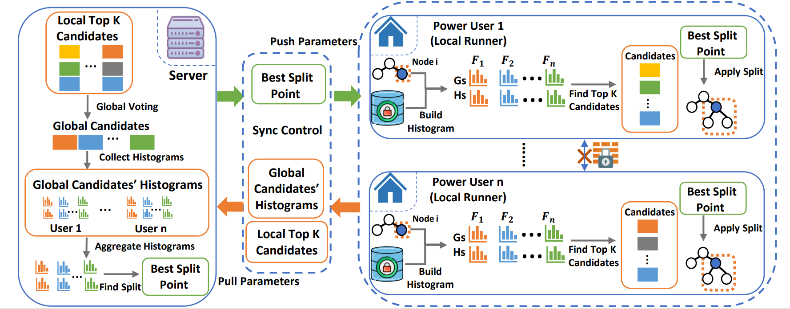
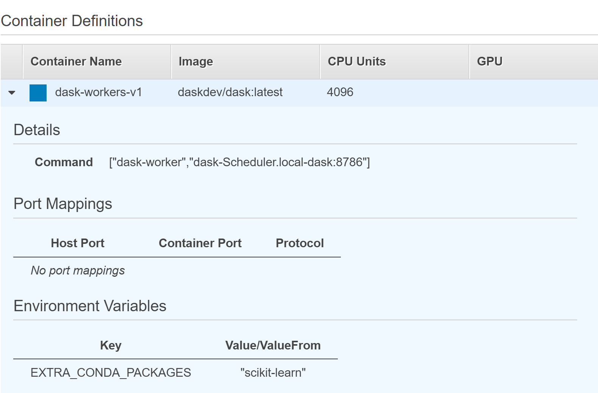

# Federated Gradient Boosting Machines for NILM Applications
This code implements  a collaborative NILM framework, Fed-GBM (Federated Gradient Boosting Machines).  Fed-GBM integrates horizontal federated learning and Gradient Boosting Decision Tree (GBDT) training.




**Requirements**

0. Implementing distributed Dask on Fargate using AWS CloudFormation
    * Follow official instruction on https://aws.amazon.com/blogs/machine-learning/machine-learning-on-distributed-dask-using-amazon-sagemaker-and-aws-fargate/
    * Container Defination for the workers in distributed Dask cluster is configured as:
	
	
    * Each workers is equipped with 4 vCPU and 4GB RAM
1. Launch a EC2 instance (72 vCPU, 144GB RAM, 2 x 900 NVMe SSD, and 25Gbps network bandwidth)
    * Install Dask.Distributed by official instruction on https://distributed.dask.org/en/latest/install.html
    * Create your virtual environment Python > 3.9
	* Install scikit-learn > 0.24.1
	* Install Numpy, Pandas, graphviz packages


# How to use the code and example

Directory tree:

``` bash
├── NILM_data_management
│   ├── redd_process.py
│   ├── refit_process.py
│   ├── ukdale_process.py
├── booster_train
│   ├── FedBooster.py
│   ├── TrainBooster_redd.py
│   └── TrainBooster_refit.py
│   ├── SingleBooster.py
│   ├── evaluate_nilm.py
│   └── data_process.py
├──config
│   ├── dask-fargate-main.template
│   ├── dask-clustere.template
│   └── template-designer.png
├── images
│   ├── container.png
│   ├── fedgbm.png
│   └── convertop.pdf
│   ├── Ktime.pdf
│   ├── reddhouse.pdf
│   └── refithouse.pdf
```
## **Create REFIT, UK-DALE or REDD dataset**
Datasets are built by the power readings of houses 1, 2, and 3 from REDD, building 1, 2 from UK-DALE, and five randomly selected houses from REFIT. For all datasets, we sampled the active load every 8 seconds. The commonly-used appliances were chosen to implement model training, such as dishwasher, fridge, washing machine, kettle, and microwave. For each dataset, 80% of samples were used for model training, and the remaining for testing. The scripts contained in NILM_data_management directory allow the user to create CSV files of training dataset across different application scenarios. Any output CSV file represents a dataset owned by a householder.

## **Training**
To implement Fed-GBM on Dask cluster, complete the following steps:

1. Ensure services status and running tasks are both set active
2. On EC2 instance, register the Dask client to the distributed Dask scheduler and build the connection
3. Setting up Network Load Balancer to monitor the Dask cluster, refering to official instruction on https://aws.amazon.com/blogs/machine-learning/machine-learning-on-distributed-dask-using-amazon-sagemaker-and-aws-fargate/

The FedBooster.py script provides booster class and main training workflow of Fed-GBM. It allocates the training dataset across the workers from Dask Fargate cluster and uses Seq2point paradigm for NILM data (pairs of multiple samples aggregate data and 1 sample midpoint ground truth).  Both TrainBooster_redd.py and TrainBooster_refit.py are the entry points for the training phase and provided as examples. Once the training is completed, the trained GBDT model will be saved into the folder you have selected. The SingleBooster.py is an alternative to build a NILM model without collaborative training.

Training default parameters:

* Windowsize: 99 samples
* Number of boosting round: 100
* Learning rate: 0.23179
* Maximum depth: 10
* Maximum bins: 500
* L1 regularisation: 0.02145
* L2 regularisation: 0.0001

# Dataset
Datasets used can be found:
1. REFIT: https://www.refitsmarthomes.org/datasets/
2. UKDALE: https://jack-kelly.com/data/
3. REDD: http://redd.csail.mit.edu/
